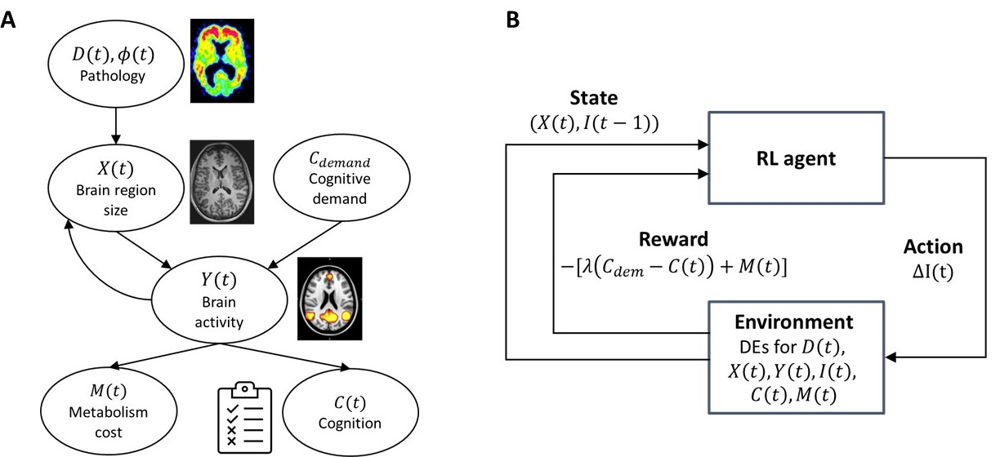

# Reinforcement learning-based disease progression model for Alzheimer's disease

Pytorch implementation for the Alzheimer's disease (AD) progression model combining differential equations (DEs) and reinforcement learning (RL) [**NeurIPS 2021**] ([link](https://proceedings.neurips.cc/paper/2021/hash/af1c25e88a9e818f809f6b5d18ca02e2-Abstract.html))

## Abstract
We model Alzheimer’s disease (AD) progression by combining differential equations (DEs) and reinforcement learning (RL) with domain knowledge. DEs provide relationships between some, but not all, factors relevant to AD. We assume that the missing relationships must satisfy general criteria about the working of the brain, for e.g., maximizing cognition while minimizing the cost of supporting cognition. This allows us to extract the missing relationships by using RL to optimize an objective (reward) function that captures the above criteria. We use our model consisting of DEs (as a simulator) and the trained RL agent to predict individualized 10-year AD progression using baseline (year 0) features on synthetic and real data. The model was comparable or better at predicting 10-year cognition trajectories than state-of-the-art learning-based models. Our interpretable model demonstrated, and provided insights into, "recovery/compensatory" processes that mitigate the effect of AD, even though those processes were not explicitly encoded in the model. Our framework combines DEs with RL for modelling AD progression and has broad applicability for understanding other neurological disorders.

<p align="center">
  
</p>
<p align="center">
<em>Framework for modeling AD progression. (A) Relationship between brain size, brain activity, information processing, and cognition (B) Framework for AD progression that combines differential equations with reinforcement learning</em>
</p>

## Packages required

 
## Installation
### Required packages
1. OpenAI Gym
2. Garage Framework (v2020.06.3)
3. Tensorflow v2.5.0
4. Numpy
5. Pandas
6. Stable Baselines

Create a new python environment and use the following command within the environment

```
pip install -r requirements.txt
```

## Repo content
- dataset: sample data files
- models: sample trained model
- notebooks: jupyter notebooks
- output: save the output from various scripts
- src: python source code


## How to use this repo
Below are examples uses of the code in the repo.

### Parameter estimation
1. Use the file notebooks/ParameterEstimation.ipynb
2. Specify the input and output file names appropriately. Input file should contain longitudinal multimodal data of individuals with columns subject ID, visit number, features, cognition. Check out sample file for an example.
3. Follow the steps in the notebook. It will generate the parameters for the data and store it in an excel/csv file.

### Running the model
Here we desribe the steps to run train the model once the parameters have been estimated. Example is shown using the sample adni data provided in dataset/processed/. To train the RL agent with various parameter configurations described in the paper. The base configuration of parameters is stored in brain.json file within src folder.
1. cd src
2. python configs/train_config.py
3. cd ../
4. Edit the NUM_THREADS variables in the run_agents.py file according to your local machine.
5. Train the agents: python run_agents.py configs/train_configs. 
6. Open the output notebook to browse the results of the experiment. Separate folder is created for each hyperparameter combination. Also, the MAE and MSE values are saved in 'results_real.csv' and 'results_syn.csv' files in the output folder.

## Evaluating a trained model
1. cd src
2. python configs/eval_config.py
3. cd ../
4. Edit the NUM_THREADS variables in the run_agents.py file according to your local machine.
5. Evaluate the agent: python run_agents.py configs/eval_configs

### Evaluating the effect of missing values on parameter estimation
1. Use the file notebooks/MissingData_ParameterEstimation.ipynb and follow steps therein.

### Evaluating benchmark model: Proposed model without RL
1. Use the file notebooks/SimulateModelwoRL.ipynb and follow the steps therein.
2. Make sure to specify the appropriate file name for data along with parameter estimates.

### Evaluating statistical relationship between individualized parameter estimates and demographic variables
1. Use the file src/models/pares_stat_test_adni.py.
2. Modify the input and output file names and paths appropriately.
2. Run the file from the command line with no arguments.

## Reference
If you found the provided code useful, please cite our work.

```
@article{saboo2021reinforcement,
  title={Reinforcement Learning based Disease Progression Model for Alzheimer’s Disease},
  author={Saboo, Krishnakant and Choudhary, Anirudh and Cao, Yurui and Worrell, Gregory and Jones, David and Iyer, Ravishankar},
  journal={Advances in Neural Information Processing Systems},
  volume={34},
  year={2021}
}
```
