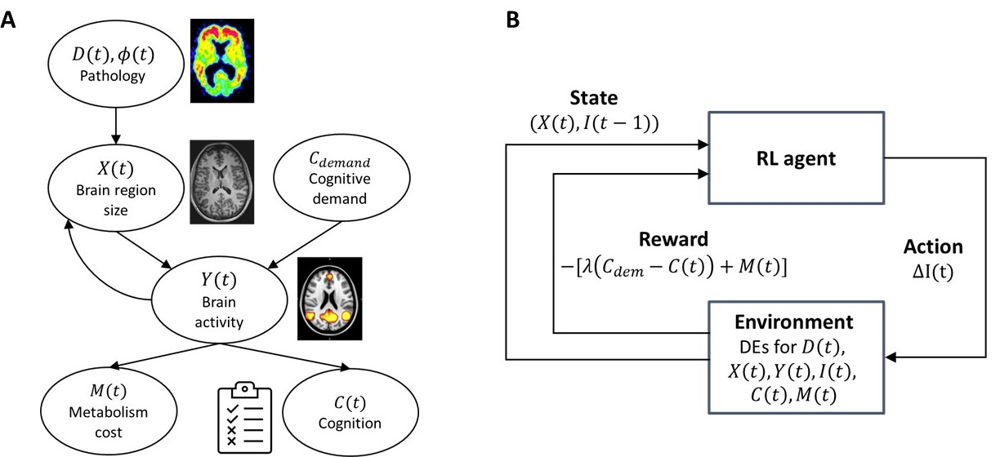

# Reinforcement learning-based disease progression model for Alzheimer's disease

Tensorflow implementation for the Alzheimer's disease (AD) progression model combining differential equations (DEs) and reinforcement learning (RL) [**NeurIPS 2021**] ([link](https://proceedings.neurips.cc/paper/2021/hash/af1c25e88a9e818f809f6b5d18ca02e2-Abstract.html))

## Abstract
We model Alzheimer’s disease (AD) progression by combining differential equations (DEs) and reinforcement learning (RL) with domain knowledge. DEs provide relationships between some, but not all, factors relevant to AD. We assume that the missing relationships must satisfy general criteria about the working of the brain, for e.g., maximizing cognition while minimizing the cost of supporting cognition. This allows us to extract the missing relationships by using RL to optimize an objective (reward) function that captures the above criteria. We use our model consisting of DEs (as a simulator) and the trained RL agent to predict individualized 10-year AD progression using baseline (year 0) features on synthetic and real data. The model was comparable or better at predicting 10-year cognition trajectories than state-of-the-art learning-based models. Our interpretable model demonstrated, and provided insights into, "recovery/compensatory" processes that mitigate the effect of AD, even though those processes were not explicitly encoded in the model. Our framework combines DEs with RL for modelling AD progression and has broad applicability for understanding other neurological disorders.

<p align="center">
  
</p>
<p align="center">
<em>Framework for modeling AD progression. (A) Relationship between brain size, brain activity, information processing, and cognition (B) Framework for AD progression that combines differential equations with reinforcement learning</em>
</p>

## Installation
### Required packages
1. OpenAI Gym
2. Garage Framework (v2020.06.3)
3. Tensorflow v2.2.0
4. Numpy
5. Pandas

Create a new python environment and use the following command within the environment

```
pip install -r requirements.txt
```

## Repository structure
- _dataset_: sample input data files (synthetic data and real-world ADNI data)
- _models_: stores the trained models under subfolders created based on input parameter combination
- _notebooks_: notebooks used for parameter estimation of differential equations and simulating synthetic data
- _output_: stores the cognition trajectories generated after evaluation (cognition plots and related values in an excel `.xlsx` file)
- _src_: code for RL model and gym environment

## How to use this repo
### Parameter estimation
1. Use the file `notebooks/ParameterEstimation.ipynb`
2. Specify the input and output file names appropriately. Input file should contain longitudinal multimodal data of individuals with columns `subject ID`, `visit number`, `features`, `cognition`. Check out sample file for an example.
3. Follow the steps in the notebook. It will generate the parameters for the data and store it in an `excel/csv` file.

### Running the model
Here we desribe the steps to run train the model once the parameters have been estimated. Example is shown using the sample ADNI data provided in `dataset/processed/` folder. To train the RL agent with various parameter configurations described in the paper, use the following command. The base configuration of parameters is stored in `src/brain.json` file.
```
cd src
python configs/train_config.py
```
Edit the `NUM_THREADS` variables in the `run_agents.py` file according to your local machine.
Train the agents by executing the following command in `src` folder
```
python run_agents.py configs/train_configs
```
A subfolder is created under `models` and `output` folders corresponding to each hyperparameter combination. The subfolder name is defined as follows:
```
{data_type}_{data split}_{RL algorithm}_{max time horizon in years}_{baseline cognition frontal}_{RL action type}_{gamma type(variable/fixed)}_{gamma}_{epochs}_{batch size}_{action bound}_{cognition initialization}_{RL discount factor}_{lambda}_{training iterations}_{energy model (inverse or inverse-squared)}_{cognition score to use(ADAS, MMSE)}_{RL network hidden layer size}
```
**Example**: `adni_split0_TRPO_11_7.0_delta_fixed_1.0_1000_1000_2.0_fixed_full_1.0_1.0_11_inverse_MMSE_32`

Energy model corresponds to how Yv is modeled as a function of Xv and Iv. Inverse model:  ; Inverse-squared model: 

The `models` folder stores training progress using tensorboard events and the trained RL model `params.pkl`. Browse the `output` folder to view the results of the experiment. Also, the MAE and MSE values are saved in `output/results_adni.csv` and `output/results_synthetic.csv` files.

## Evaluating a trained model
```
cd src
python configs/eval_config.py
```
Edit the NUM_THREADS variables in the run_agents.py file according to your local machine.
Evaluate the trained RL model by executing the following command in `src` folder
```
python run_agents.py configs/eval_configs
```
Browse the `output` folder to view the results of the experiment.

### Evaluating the effect of missing values on parameter estimation
1. Use the file `notebooks/MissingData_ParameterEstimation.ipynb` and follow steps therein.

### Evaluating benchmark model: Proposed model without RL
1. Use the file `notebooks/SimulateModelwoRL.ipynb` and follow the steps therein.
2. Make sure to specify the appropriate file name for data along with parameter estimates.

### Evaluating statistical relationship between individualized parameter estimates and demographic variables
1. Use the file `src/models/pares_stat_test_adni.py`.
2. Modify the input and output file names and paths appropriately.
2. Run the file from the command line with no arguments.

## Reference
If you use the provided code or results in your research, please use the following BibTeX entry to cite our work.

```
@article{saboo2021reinforcement,
  title={Reinforcement Learning based Disease Progression Model for Alzheimer’s Disease},
  author={Saboo, Krishnakant and Choudhary, Anirudh and Cao, Yurui and Worrell, Gregory and Jones, David and Iyer, Ravishankar},
  journal={Advances in Neural Information Processing Systems},
  volume={34},
  year={2021}
}
```
